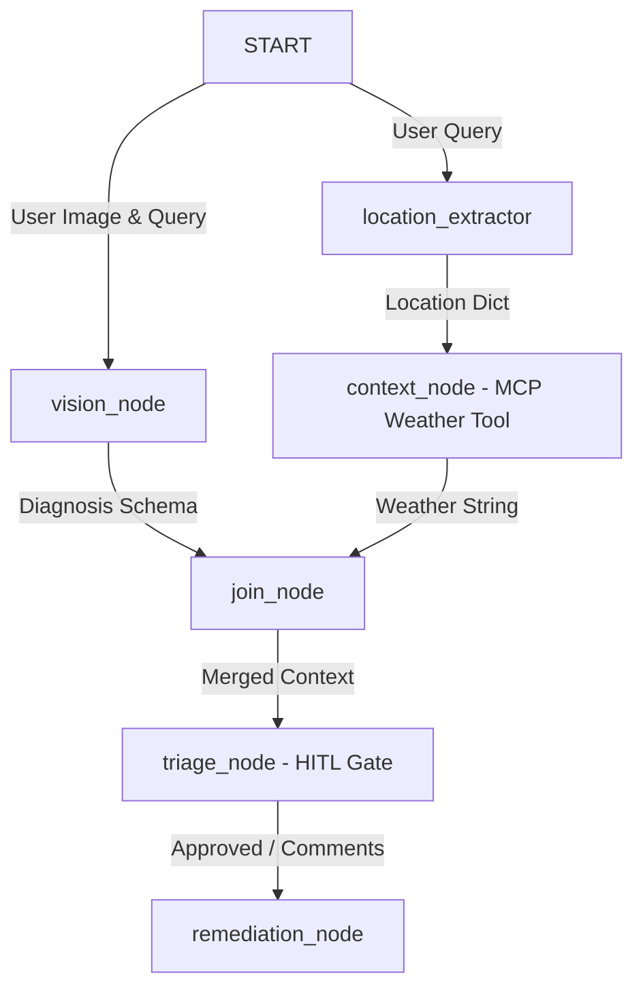

# TerraGro: The Multimodal AI Agronomist

**Track**: Agents for Good (Agricultural Sustainability & Crop Protection)

TerraGro is an ambient agricultural assistant designed to help smallholder farmers and agricultural extension workers diagnose crop conditions, assess localized environmental parameters, and generate safe, context-aware remediation plans. Built using the **Agent Development Kit (ADK 2.0)** framework, TerraGro combines multimodal computer vision with real-time Model Context Protocol (MCP) data feeds and structured human-in-the-loop triage to ensure high-fidelity agricultural advice.

---

## 🏗️ ADK 2.0 Graph Workflow Layout

TerraGro replaces traditional, unstructured agent loops with a deterministic, graph-based workflow layout. This guarantees concurrent processing of diagnosis and weather context before human validation.



### Node Specifications

1. **`vision_node` (LlmAgent)**:
   - **Target Model**: `gemini-3.1-flash-lite`
   - **Role**: Performs plant pathology analysis. It ingests the farmer's crop image and parses visual symptoms to return a structured Pydantic `DiagnosisOutput` (condition, severity, and key findings).
2. **`location_extractor` (FunctionNode)**:
   - **Role**: A lightweight, deterministic regex parser that extracts geographic tags (e.g., Salinas Valley, Seattle, Iowa) from the user's textual input.
3. **`context_node` (ToolNode / MCP)**:
   - **Target Tool**: `get_weather` via Model Context Protocol (MCP)
   - **Role**: Spawns a local stdio MCP server (`app/weather_mcp_server.py`) and fetches localized environmental data (temperature, relative humidity, rain likelihood, soil temp) which are critical for disease epidemiology.
4. **`join_node` (JoinNode)**:
   - **Role**: Fans-in parallel data streams from the `vision_node` and `context_node`, merging the crop disease assessment and the environmental parameters.
5. **`triage_node` (FunctionNode / HITL)**:
   - **Role**: Pauses workflow execution using a `RequestInput` yield. This acts as a human-in-the-loop checkpoint, prompting the agronomist to review the diagnosis and weather context. Once validated (or overridden with comments), it passes the data downstream via the `"approved"` route.
6. **`remediation_node` (LlmAgent)**:
   - **Target Model**: `gemini-3.1-flash-lite`
   - **Role**: Ingests the validated diagnostic payload and generates a structured, actionable `RemediationPlan` (treatment steps, preventative measures).

---

## 🛠️ Step-by-Step Terminal Setup

TerraGro uses the `uv` tool suite for dependency isolation and local package execution.

### 1. Clone the Repository
```bash
git clone https://github.com/SiddharthKorukonda/terragro-agent.git
cd terragro-agent
```

### 2. Initialize the Virtual Environment & Dependencies
Use `uv` to automatically bootstrap the environment and download all required SDKs:
```bash
# Installs uv globally if you do not have it
pip install uv

# Resolves dependencies and sets up the local .venv
uv sync
```

### 3. Run Google Agents CLI Setup
Install the `agents-cli` binary and pull down the development toolkit:
```bash
# Installs agents-cli into the local package manager bin
uv tool install google-agents-cli

# Installs the ADK Agent skills suite
uvx google-agents-cli setup
```

### 4. Configure Environment Credentials
Create a `.env` file in the root of the project to set up the Google AI Studio Gemini API Key:
```bash
cat <<EOT >> .env
# Gemini API via Google AI Studio API credential
GEMINI_API_KEY="YOUR_GEMINI_API_KEY_HERE"
EOT
```

### 5. Execute Local Verification & Integration Tests
Verify that the workflow, dependencies, and credentials compile cleanly:
```bash
# Run pytest integration suite to test the Workflow runner
uv run pytest tests/integration/test_agent.py
```

### 6. Run Automated Safety Evaluations
Run batch evaluations to test the crop disease and weather scenarios:
```bash
# Sets the EVAL_RUN flag to bypass HITL pause during automated grading
EVAL_RUN=true uv run agents-cli eval run --dataset tests/eval/evalsets/terragro.evalset.json
```

---

## 🛡️ 'Shift Security Left' Features

TerraGro enforces strict technical guardrails to protect credentials, input schemas, and code quality before changes ever hit remote branches.

1. **Pre-Commit Security Gates**:
   Our `.pre-commit-config.yaml` runner enforces automated quality gates on every local commit:
   - `trailing-whitespace` & `end-of-file-fixer` for formatting standardization.
   - `check-yaml` for syntax validation.
   - `check-added-large-files` (limited to `1000KB` to verify lockfiles).
   - **Local Semgrep Hook**: Scans python code against 1000+ security and vulnerability rules (e.g., checking for SQL injections, command injections, and unsafe parsing).
2. **Credential Exclusion Rules (`.gitignore`)**:
   We explicitly blacklisted:
   - `.env` files containing private AI Studio credentials.
   - `artifacts/` containing grading JSON results and local execution traces.
   This guarantees that sensitive data can never be accidentally staged, committed, or pushed to GitHub.
3. **Structured Input Schema Contracts**:
   By using typed Pydantic models for both internal node-to-node transfers and final responses, we eliminate prompt injection payloads that attempt to hijack the LLM's system state.
